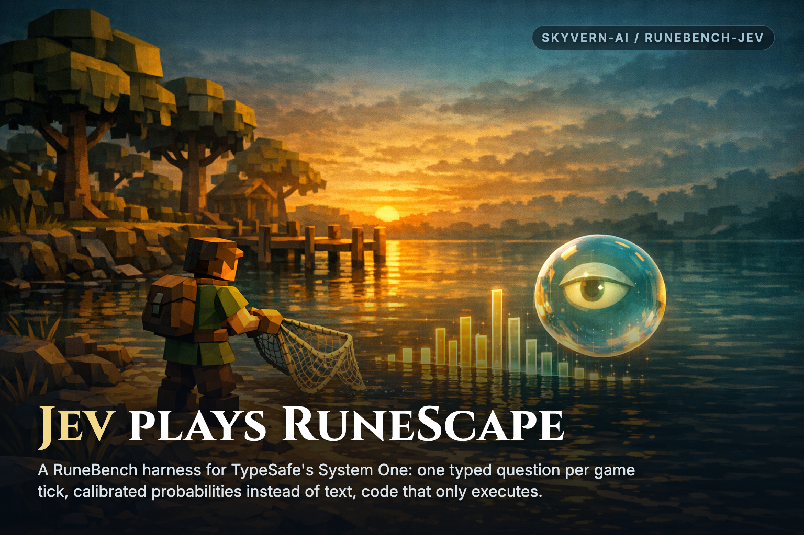
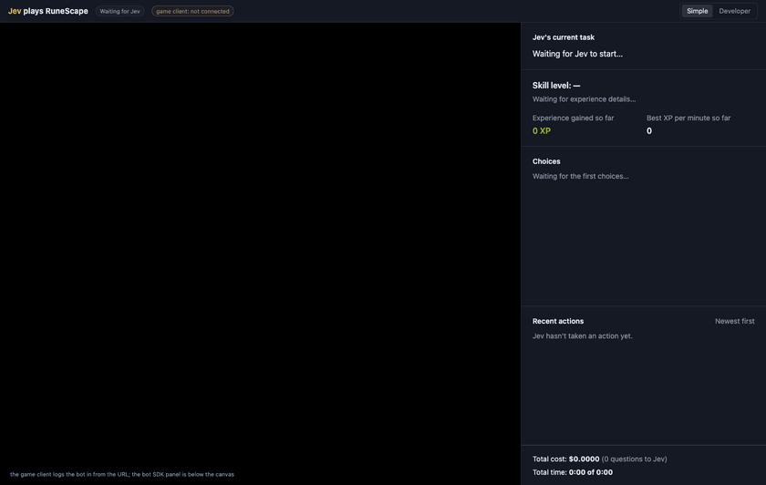

# RuneBench with Jev

A RuneBench fork with a harness that lets TypeSafe's Jev play RuneScape.

## What it is

This repository forks [RuneBench](https://github.com/MaxBittker/rs-bench), Max Bittker's RuneScape agent benchmark. The harness connects Jev to the game through a separate [rs-sdk](https://github.com/MaxBittker/rs-sdk) checkout. See the [upstream README](docs/upstream-runebench-README.md) for RuneBench documentation.

Jev, TypeSafe's "System One," is a non-generative model. It answers typed questions (`choice`, `noul`, `score`) with calibrated probabilities. It writes no text or code and calls no tools. It cannot use RuneBench's OpenCode agent adapter.

The harness offers about 50 bounded actions built on rs-sdk. These include fishing, chopping, mining, cooking, fighting, buying, selling, dropping, walking, closing dialogs, and eating. Jev decides; code executes each action. Jev returns a probability for every offered option. The dashboard shows this distribution as its "thinking."

## Demo



A fresh character walks from Lumbridge to Draynor and starts net fishing. The recording uses real speed and real XP rates.

| Recording | Value |
| --- | --- |
| Play time | 10 minutes |
| Playback speed | About 15x |

[Watch the MP4](docs/media/jev-fishing-10min.mp4).

## How Jev plays

### Burst mode and tick mode

Burst mode runs one action per burst. Jev then picks the next action. The skill sweep uses this mode. Tick mode asks Jev during live play. Set the base poll interval with `--poll-every N`.

| Timing | Value |
| --- | --- |
| Burst duration | 20 seconds; 60 seconds at 1x speed |
| Skill sweep task duration | 15 minutes |
| Game tick at real speed | 400 ms |

Each tick-mode poll asks two questions:

| Question | Options and effect |
| --- | --- |
| `next_action` | The CURRENT action or another catalog action. Only a different goal stops the running action. |
| `this_tick` | `do_nothing` (normal), `close_dialog`, `eat_food`, or `restart_current` (re-click the target). These actions keep the goal. |

Jev also answers `poll_again_in_ticks` with N, 2N, 5, or 10. This answer sets the next poll time. The answer timeout equals the poll interval. A late answer keeps the current action.

### Facts and code responsibilities

No code rule decides for Jev. Each poll supplies these facts:

- Player status: `idle`, `moving`, `animating`, `skilling`, `under_attack`, `in_dialog`, or `dead`.
- Hitpoints and damage taken in the last 10 seconds.
- Target name and seconds since the last XP drop.
- Last server message.
- Last eight events: action starts, XP drops, server messages, damage, deaths, restarts, and switches.

Code executes catalog actions and reports game state. Fishing scripts click the spot once and hold. Every re-click comes from Jev's `restart_current` decision. Code checks game state before retrying a click that the SDK reports as rejected. A blind retry previously ended the engine's fishing loop.

The live stack applies two small rs-sdk patches. `walkTo` cancellation stops walking when Jev switches actions. The level-curve patch uses the real RuneScape curve. Use `--xprate 1` for real XP rates.

| rs-sdk setting | Shipped value | Live value |
| --- | --- | --- |
| Level curve | 2^(level/10) | 2^(level/7) |
| XP multiplier | 25 | 1 with `--xprate 1` |

## Quick start

Install bun. Keep an rs-sdk checkout at `../rs-sdk`. Set `TYPESAFE_API_KEY` in your environment. No other secret is required. The local runner needs no Docker.

Start the live stack:

```sh
agents/jev/live-stack.sh up ../rs-sdk --skill Fishing --minutes 30 --policy jev --bot skyvern --speed 1 --xprate 1 --mode tick --poll-every 3
```

This command starts the engine, gateway, controller, and dashboard. Open [the dashboard](http://localhost:7790/). Keep exactly one dashboard tab open. Keep that tab visible during login. Chrome pauses background tabs, so the game client only logs in while visible. A second dashboard tab takes over the game session.

The dashboard embeds the bot's own browser game client beside a sidebar. Simple view shows the task, skill level, XP to next level, ranked choices, and percentages. It also shows this-tick actions, recent actions, total cost, and time. Developer view adds the full state snapshot, probability bars, latency, tokens, and controller log.

[Simple view](results/jev-live/dashboard-simple-tick-mode.png) · [Developer view](results/jev-live/dashboard-developer-tick-mode.png)

Stop the stack:

```sh
agents/jev/live-stack.sh down
```

### Benchmark commands

Run the local sweep with one isolated engine per task:

```sh
agents/jev/local-bench.sh
```

Aggregate Jev and random-policy results:

```sh
bun agents/jev/aggregate.ts --run jev=runs/jev-15m --run random=runs/random-15m
```

The Harbor adapter uses `agents/jev_adapter.py` and `scripts/run-jev.sh`. See [the harness README](agents/jev/README.md) for details, caveats, and the full design.

## Results

RuneBench scores the best 15-second XP window as peak XP/min.

| Sweep conditions | Value |
| --- | --- |
| Date | 2026-09-18 |
| Task duration | 15 minutes |
| Skills | 16 |
| Runner | Local, no Docker |
| World speed | 20 ticks/s |

| Policy or model | Mean peak XP/min |
| --- | ---: |
| Random policy, same catalog | 235 |
| Jev | 197 |
| Claude Opus, best complete leaderboard model | 118 |

Jev gained more total XP through steady play. The peak metric rewards random's lucky bursts. Jev won on tasks that needed a multi-step chain.

| Additional result | Value |
| --- | ---: |
| Jev total XP / random total XP | 2.1x |
| Jev Fishing peak XP/min, fly fishing chain | 920 |
| Jev Fletching peak XP/min | 213 |
| Jev Crafting peak XP/min | 48 |
| All leaderboard models on those three skills | 0 |
| Whole Jev sweep decisions | 1,307 |
| Whole Jev sweep input tokens | 4.14 M |
| Whole Jev sweep cost | $0.17 |

The catalog carries the game knowledge. This comparison mostly measures the action space, not the model. Always present Jev beside the random baseline.

### Live run evidence

These Fishing observations use real speed, real XP, and `--poll-every 3` on 2026-09-18.

| Observation window | Value |
| --- | --- |
| Duration / game ticks | 107 seconds / 266 |
| Polls / timeouts | 28 / 0 |
| Fishing level | 5 to 6 |
| Time between catches | 7 to 20 seconds |
| `this_tick`: `do_nothing` / `restart_current` | 27 / 1 |
| Quiet time before restart | 21 seconds |

An earlier 30-minute run showed inventory handling and recovery. Jev dropped the catch when the inventory filled, then returned to fishing. It closed level-up dialogs without stopping fishing. It restarted the spot after it moved.

## Cost profile

These figures cover live tick-mode Fishing runs at real speed on 2026-09-18. Luna and Astra costs apply their rates to the same token counts. Nobody ran Luna or Astra here.

| Model | Input / M tokens | Cached input / M tokens | Output / M tokens |
| --- | ---: | ---: | ---: |
| Jev | $0.042 | | Free |
| Luna (`gpt-5.6-luna`) | $0.20 | $0.02 | $1.20 |
| Astra (`gpt-6-astra`) | $10 | | $50 |

| Measured usage | Value |
| --- | ---: |
| Input per poll, JSON state and option descriptions | About 3,950 tokens |
| Output per poll, answer JSON | About 120 tokens |
| Median / p90 latency | 0.22 s / 0.31 s |
| All live polls | 13,402 |
| All live input / output tokens | 52.9 M / 1.63 M |
| Total play time | 3.04 hours |

| Cost for all live runs | Cost |
| --- | ---: |
| Jev | $2.22 |
| Luna, list price | $12.55 |
| Luna, 90% cached input | $3.97 |
| Astra | $611 |

| Poll schedule at real speed | Jev / hour | Luna / hour, list | Astra / hour |
| --- | ---: | ---: | ---: |
| Every tick, 2.5 polls/s | About $0.80–$1.00 | About $4.50–$5.30 | About $150–$300 |
| Every 3 ticks, Jev stretches most polls to 10 ticks | $0.55 | $3.14 | About $150 |

A generative model answers in seconds, not about 0.2 seconds. It could not answer every tick. This comparison covers cost only.

## Repo layout

| Path | Contents |
| --- | --- |
| `agents/jev/` | Jev harness, live stack, local benchmark, and design documentation |
| `agents/jev_adapter.py` | Harbor adapter |
| `scripts/run-jev.sh` | Harbor run script |
| `shared/pricing.ts` | Pricing |
| `results/jev-15m/` | Skill sweep results |
| `results/jev-live/` | Live run results and dashboard screenshots |
| `docs/` | Upstream README and media |

## Credits

[RuneBench](https://github.com/MaxBittker/rs-bench) and [rs-sdk](https://github.com/MaxBittker/rs-sdk) are by Max Bittker.
Jev is by TypeSafe.
